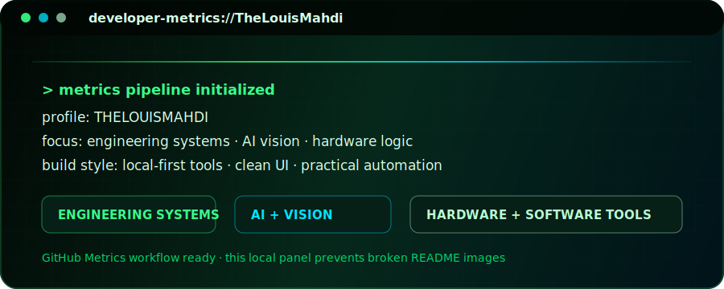

<div align="center">


<br />

<p>
  <strong>Online, you may know me as poimu, eka, or Eka Francium.</strong>
</p>

<p>
  To me, <strong>Eka Francium</strong> means an element that does not fully belong to the known table yet - rare, experimental, slightly unstable, and still being defined.<br />
  That is close to how I build things: quietly, logically, obsessively, and always one step beyond the obvious.
</p>

</div>

---

<div align="center">

# Mahdi Ghahremani

### Electrical Engineering Student · AI & Computer Vision · Hardware & Digital Systems


<br />

<a href="https://github.com/TheLouisMahdi">
  
</a>
<a href="https://t.me/thelouis_mahdi">
  
</a>


<br /><br />


</div>

---

## 👨‍💻 About Me

<div align="center">


<br />
<br />

<table>
  <tr>
    <td align="center" width="190">
      <b>IDENTITY</b><br />
      <code>Mahdi Ghahremani</code>
    </td>
    <td align="center" width="190">
      <b>SIGNATURE</b><br />
      <code>THELOUISMAHDI</code>
    </td>
    <td align="center" width="190">
      <b>ALIAS</b><br />
      <code>Eka Francium</code>
    </td>
    <td align="center" width="190">
      <b>BUILD STYLE</b><br />
      <code>Local-first systems</code>
    </td>
  </tr>
</table>

<br />


<br />
<br />


<br />
<br />


<br />



<br />
<br />


</div>

I build practical systems at the intersection of engineering, software, AI, and hardware. My work usually starts from a technical problem and ends as a usable tool, prototype, or intelligent workflow.

Some applied projects stay private because of technical, team, or company-related limitations.

---

## 🧭 Current Roles

<table>
<tr>
<td width="50%">

### 🏝️ Technical Lead

Technical Lead of the **Three Islands Team**.

</td>
<td width="50%">

### 👁️ Rast Eye

Technical, Software, and AI Engineer at **Rast Eye**.

</td>
</tr>
</table>

---

## 🚀 Focus Areas

<table>
<tr>
<td width="50%">

### 👁️ Computer Vision

- Image processing
- Object detection and recognition
- Visual monitoring systems
- Feature extraction
- Camera-based intelligent systems

</td>
<td width="50%">

### 🧬 Deep Learning

- Convolutional Neural Networks
- Model training and evaluation
- Pattern recognition
- Classification and prediction models
- Applied neural network workflows

</td>
</tr>
<tr>
<td width="50%">

### 🌱 Smart Engineering Systems

- Smart irrigation intelligence
- Environmental and sensor data analysis
- Decision-support systems
- Resource optimization
- Signal and time-series analysis

</td>
<td width="50%">

### ⚙️ Hardware + Digital Systems

- Electronics and circuit design
- Digital logic and FPGA concepts
- Embedded systems concepts
- Hardware/software integration
- Real-world engineering automation

</td>
</tr>
</table>

---

## 🛠️ Tech Stack & Tools

<div align="center">


</div>

---

## 🎯 How I Build

```txt
Practical AI        ██████████  100%
Engineering         █████████░   90%
Computer Vision     █████████░   90%
Creative Systems    ████████░░   80%
Hardware Thinking   ████████░░   80%
```

I like projects that are **useful**, **clean**, **experimental**, and connected to real-world problems.  
Sometimes a small tool built carefully is more valuable than a large unfinished idea.

---

## 🌌 More About Me

- 🎓 Electrical Engineering student
- 💻 Developer since age 15
- 🧠 First programming language: **C#**
- 🤖 Interested in AI, computer vision, and deep learning
- ⚡ Interested in electronics, digital systems, and hardware design
- 🌱 Interested in smart irrigation, sensor-based intelligence, and engineering AI
- 🎥 Film enthusiast
- 🧪 I like learning by making real projects

---

## 🧩 How I Think

I usually start with ideas. When I see something, I naturally begin thinking about how it could be improved, rebuilt, or solved in a better way.

I enjoy struggling with problems, experimenting, failing, trying again, and pushing forward until the work is finished.

Because I am both a **starter** and a **finisher**.

---

## 📬 Contact

<div align="center">

I only use Telegram for social communication.

<a href="https://t.me/thelouis_mahdi">
  
</a>

<br /><br />

```txt
Telegram ID: @thelouis_mahdi
GitHub:      TheLouisMahdi
Name:        Mahdi Ghahremani
```

</div>

---

<div align="center">

### The most enjoyable thing in the world for me is learning.

</div>