<div align="center">



<br />
<br />

# Mahdi Ghahremani

### Electrical Engineering Student · AI Vision · Hardware-Software Systems

<a href="https://github.com/TheLouisMahdi">
  
</a>
<a href="https://t.me/thelouis_mahdi">
  
</a>


<br />
<br />


</div>

---

## 👨‍💻 About Me

I'm **Mahdi Ghahremani**, also known online as **TheLouisMahdi**, **poimu**, **eka**, or **Eka Francium**.

I build practical systems at the intersection of **engineering**, **software**, **AI**, and **hardware**. My work usually starts from a technical problem and ends as a usable tool, prototype, or intelligent workflow.

The name **Eka Francium** represents how I like to build: experimental, slightly unstable in the creative sense, and always trying to move one step beyond the obvious.

Some applied projects stay private because of technical, team, or company-related limitations.

---

## 🧭 Current Roles

<table>
<tr>
<td width="50%">

### 🏝️ Three Islands Team

Technical Lead, focused on engineering decisions, system design, and technical coordination.

</td>
<td width="50%">

### 👁️ Rast Eye

Technical, Software, and AI Engineer working on applied computer vision and intelligent systems.

</td>
</tr>
</table>

---

## 🚀 Focus Areas

<table>
<tr>
<td width="50%">

### 👁️ Computer Vision

- Image processing
- Object detection and recognition
- Visual monitoring systems
- Feature extraction
- Camera-based intelligent systems

</td>
<td width="50%">

### 🧬 Applied AI

- Deep learning workflows
- Model training and evaluation
- Pattern recognition
- Classification and prediction models
- AI-assisted engineering systems

</td>
</tr>
<tr>
<td width="50%">

### 🌱 Smart Engineering Systems

- Smart irrigation intelligence
- Environmental and sensor data analysis
- Decision-support systems
- Resource optimization
- Signal and time-series analysis

</td>
<td width="50%">

### ⚙️ Hardware + Digital Systems

- Electronics and circuit design
- Digital logic and FPGA concepts
- Embedded systems concepts
- Hardware/software integration
- Real-world engineering automation

</td>
</tr>
</table>

---

## 🧩 Selected Projects

<table>
<tr>
<td width="50%">

### 🟢 NPVT Terminal Converter

A local-first browser tool for converting between NPVT containers, V2Ray-style links, and Xray/V2Ray JSON profiles.

</td>
<td width="50%">

### 🧠 Lights Out GF(2) Solver

An offline puzzle engine and solver built around linear algebra over GF(2), custom board generation, and automatic solving.

</td>
</tr>
</table>

---

## 🛠️ Tech Stack & Tools

<div align="center">


</div>

---

## 🎯 How I Build

```txt
Practical AI        ██████████  100%
Engineering         █████████░   90%
Computer Vision     █████████░   90%
Creative Systems    ████████░░   80%
Hardware Thinking   ████████░░   80%
```

I like projects that are **useful**, **clean**, **experimental**, and connected to real-world problems. A small tool built carefully is often more valuable than a large unfinished idea.

---

## 🧠 How I Think

I usually start with ideas. When I see a system, I naturally think about how it could be improved, rebuilt, simplified, or solved in a better way.

I enjoy the process of struggling with problems, testing different paths, failing, fixing, and pushing forward until the work is finished.

---

## 📬 Contact

<div align="center">

I only use Telegram for social communication.

<a href="https://t.me/thelouis_mahdi">
  
</a>

<br />
<br />

```txt
Telegram ID: @thelouis_mahdi
GitHub:      TheLouisMahdi
Name:        Mahdi Ghahremani
```

</div>

---

<div align="center">

### The most enjoyable thing in the world for me is learning.

</div>